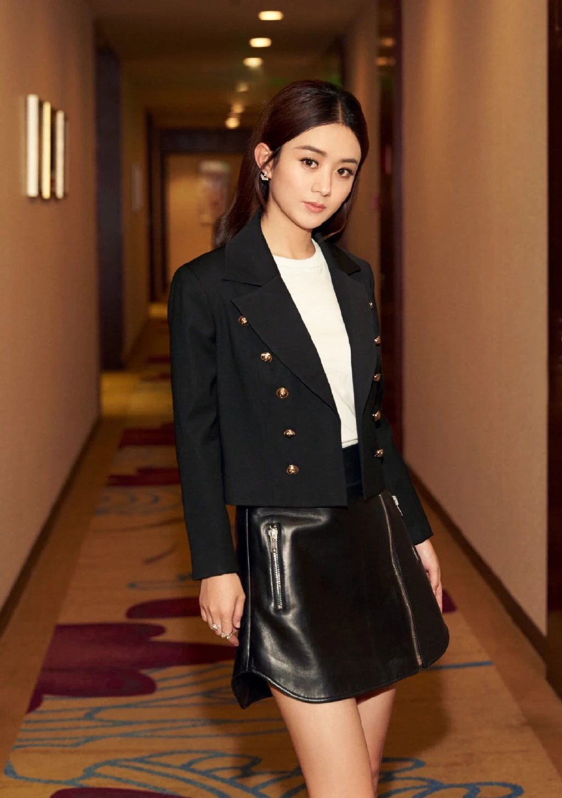
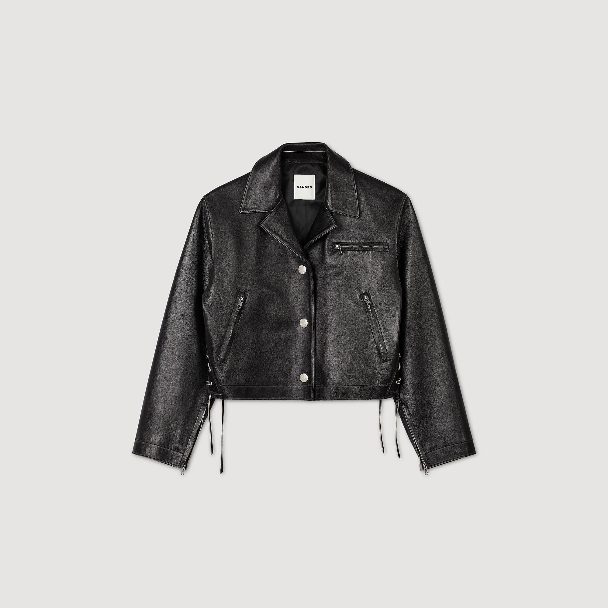
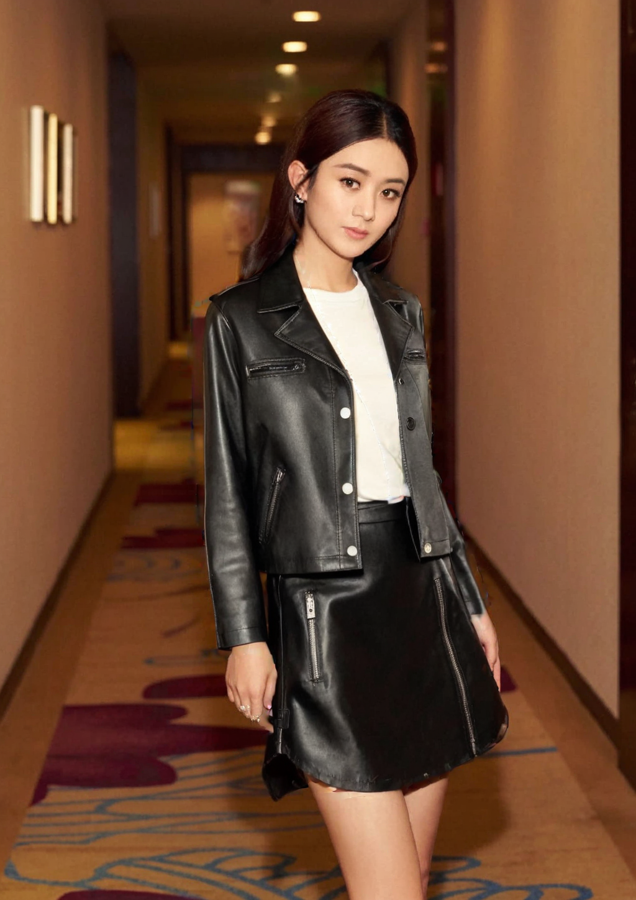
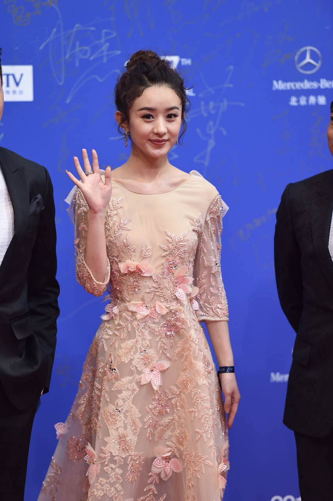
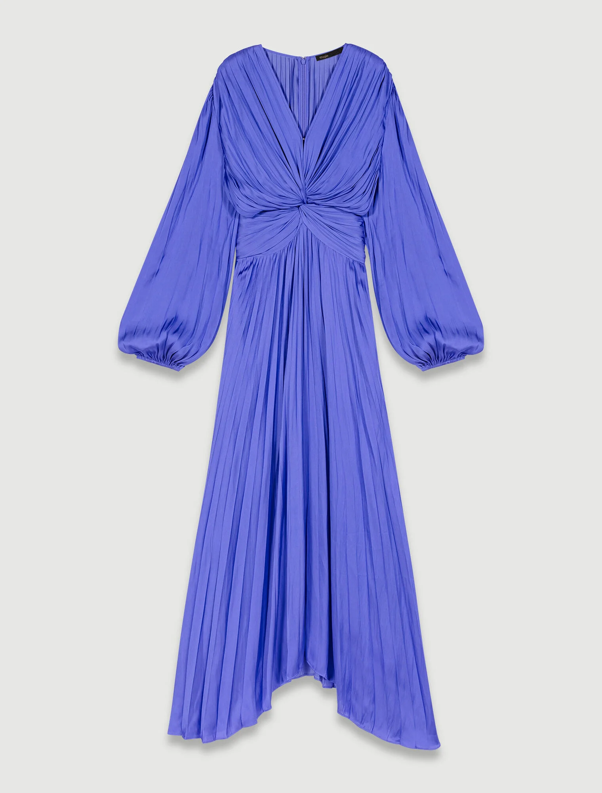
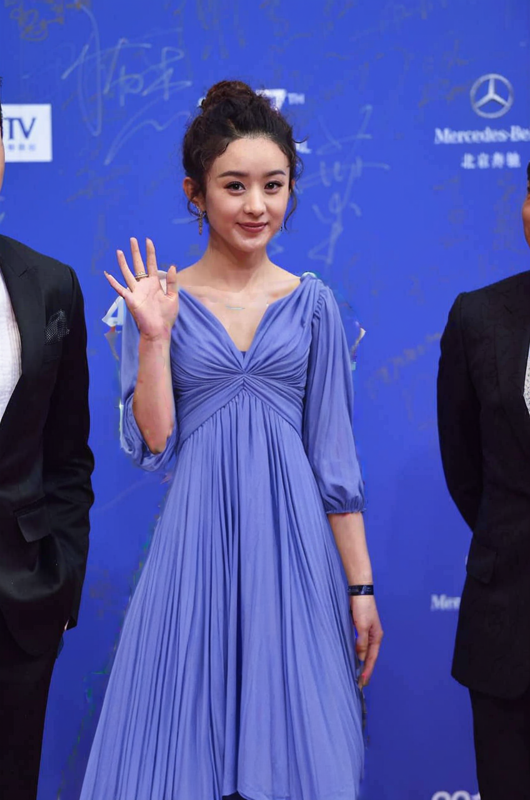
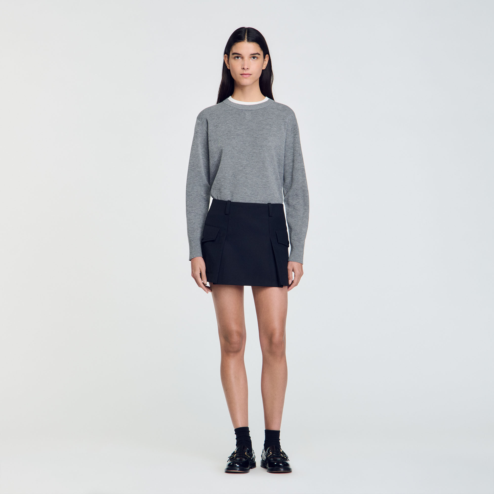
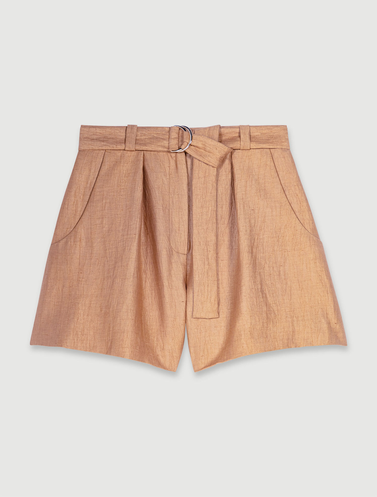
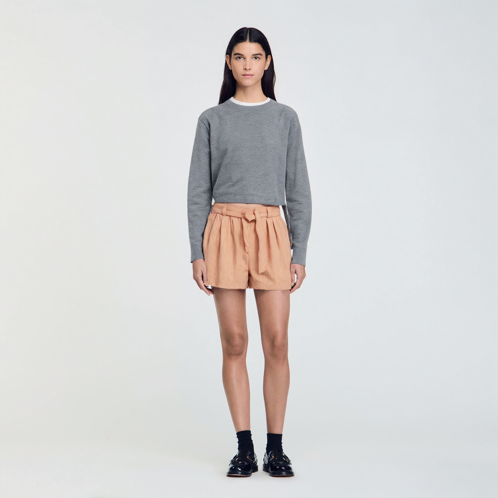

# ComfyUI-Cloth-Swap-Workflow
[ComfyUI](https://github.com/comfyanonymous/ComfyUI) workflow for cloth-swapping. 

Utilize SAM models to segment the clothing in model image, and IP-Adapter for image-to-image conditioning.

### Some results
  

  

  

## Required Costum Nodes
- [ComfyUI_IPAdapter_plus](https://github.com/cubiq/ComfyUI_IPAdapter_plus)
- [segment anything](https://github.com/storyicon/comfyui_segment_anything)
- [ComfyUI Impact Pack](https://github.com/ltdrdata/ComfyUI-Impact-Pack)
- [comfyui-art-venture](https://github.com/sipherxyz/comfyui-art-venture)

## Model Used
- [AlbedobaseXL v2.1](https://civitai.com/models/140737/albedobase-xl) for inpainting
- [epiCPhotoGasm Ultimate Fidelity](https://civitai.com/models/132632?modelVersionId=429454) for detail refining

Please share any models you found with better results🤗

## Limitation
- The input clothing style should be similar to the input character clothing.
- The clothing with ornate design may look different on the person after swapping.
- LoRAs and ControlNets are not specifically trained according to any fashion brand. (If you tried any well-performed ones, feel free to share!)

